# GUI编程

---

[TOC]

---


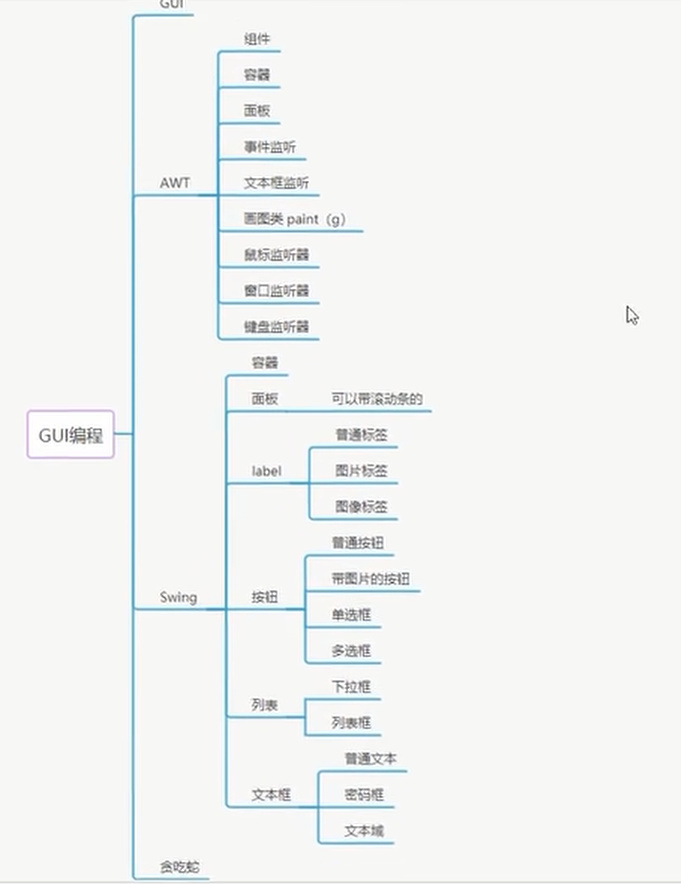

https://www.cnblogs.com/lianxin/archive/2012/05/26/2519527.html1

## 一、初识GUI


### 1、简介

GUI的核心技术：Swing	SWT
1、因为界面不美观
2、需要jre环境


### 2、AWT

#### 2.1AWT介绍


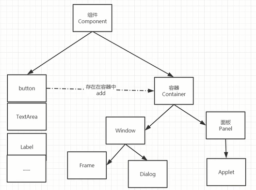


#### 2.2 组件和容器

##### 2.2.1 Frame

```java
package cn.akio.lesson01;

import java.awt.*;

//GUI的第一个界面
public class TestFrame {
    public static void main(String[] args) {
        //设置Frame对象
        Frame frame = new Frame("我的第一个java图形界面窗口");

        //需要设置可见性
        frame.setVisible(true);

        //设置窗口大小
        frame.setSize(400,400);

        //设置背景颜色
        frame.setBackground(new Color(71, 69, 234));

        //窗口弹出的初始位置，即为窗口左上角的所在位置
        frame.setLocation(200,200);

        //设置大小固定，即窗口不能拉伸和缩小
        frame.setResizable(false);
    }
}
```

效果如下：


但是这有个问题：发现窗口点X关不掉，只有停止java程序才行

---

```java
回顾一下封装
package cn.akio.lesson01;

import java.awt.*;

public class TestFrame2 {
    public static void main(String[] args) {
        //展示多个窗口
        new MyFrame(100, 100, 400, 200, Color.blue);
        new MyFrame(300, 100, 400, 200, Color.yellow);
        new MyFrame(100, 300, 400, 200, Color.red);
        new MyFrame(300, 300, 400, 200, Color.magenta);
    }
}
class MyFrame extends Frame{//封装
    static int id = 0;//可能存在多个窗口，我们需要一个计数器
    public MyFrame(int x, int y, int width, int height, Color color){
        super("MyFrame"+(++id));//title:窗口标签,调用父类构造
        setBackground(color);
        setBounds(x,y,width,height);
        setVisible(true);
    }
}
```


##### 2.2.2 面板Panel

这里解决了关闭问题

```java
package cn.akio.lesson01;

import java.awt.*;
import java.awt.event.WindowAdapter;
import java.awt.event.WindowEvent;

//Panel 可以看成是一个空间，但是不能单独存在
public class TestPanel {
    public static void main(String[] args) {
        Frame frame = new Frame();

        //布局的概念
        Panel panel = new Panel();

        //设置布局
        frame.setLayout(null);

        //坐标
        frame.setBounds(300, 300, 500, 500);
        frame.setBackground(new Color(40, 161, 35));

        //panel设置坐标，相对于frame
        panel.setBounds(50, 50, 400, 400);
        panel.setBackground(new Color(193,15,60));

        //将面板布局到界面
        frame.add(panel);

        //设置可见性
        frame.setVisible(true);

        //监听事件，监听窗口关闭事件 System.exit(0）
        //适配器模式
        frame.addWindowListener(new WindowAdapter() {
            //窗口点击关闭的时候需要做的事情
            @Override
            public void windowClosing(WindowEvent e) {
                //要做什么，结束程序
                System.exit(0);
            }
        });
    }
}
```


#### 2.3 布局管理器

- 流式布局

  ```java
  package cn.akio.lesson01;
  
  import java.awt.*;
  //流式布局
  public class TestFlowLayout {
      public static void main(String[] args) {
          Frame frame = new Frame();
  
          //组件-按钮
          Button button1 = new Button("buttom1");
          Button button2 = new Button("button2");
          Button button3 = new Button("button3");
  
          //设置为流式布局
          //frame.setLayout(new FlowLayout());//默认居中
          //frame.setLayout(new FlowLayout(FlowLayout.LEFT));//居左
          frame.setLayout(new FlowLayout(FlowLayout.RIGHT));
  
  
          frame.setSize(500,500);
  
          //把按钮添加上去
          frame.add(button1);
          frame.add(button2);
          frame.add(button3);
  
          frame.setVisible(true);
      }
  }
  ```

  

- 东西南北中

  ```java
  package cn.akio.lesson01;
  
  import java.awt.*;
  //东西南北中式布局
  public class TestBorderLayout {
      public static void main(String[] args) {
          Frame frame = new Frame("TestBorderLayout");
  
          Button east = new Button("East");
          Button west = new Button("West");
          Button south = new Button("South");
          Button north = new Button("North");
          Button center = new Button("Center");
  
          frame.add(east, BorderLayout.EAST);
          frame.add(west, BorderLayout.WEST);
          frame.add(south, BorderLayout.SOUTH);
          frame.add(north, BorderLayout.NORTH);
          frame.add(center, BorderLayout.CENTER);
  
          frame.setSize(200,200);
          frame.setVisible(true);
      }
  }
  ```

  

- 表格布局 Grid

  ```java
  package cn.akio.lesson01;
  
  import java.awt.*;
  
  //表格布局
  public class TestGridLayout {
      public static void main(String[] args) {
          Frame frame = new Frame("TestGridLayout");
          Button btn1 = new Button("btn1");
          Button btn2 = new Button("btn2");
          Button btn3 = new Button("btn3");
          Button btn4 = new Button("btn4");
          Button btn5 = new Button("btn5");
          Button btn6 = new Button("btn6");
  
          frame.setLayout(new GridLayout(3,2));
  
          frame.add(btn1);
          frame.add(btn2);
          frame.add(btn3);
          frame.add(btn4);
          frame.add(btn5);
          frame.add(btn6);
  
          frame.pack();//是JAVA语言的一个函数，这个函数的作用就是根据窗口里面的布局及组件的preferredSize来确定frame的最佳大小。
          frame.setVisible(true);
      }
  }
  ```

  

  ---

  TEstWOrk：根据前面知识创建如图

  

  分析：

  

  ```java
  package cn.akio.lesson01;
  
  import java.awt.*;
  
  public class TestWork {
      public static void main(String[] args) {
          //总
          Frame frame = new Frame("TestWork");
          frame.setSize(400, 400);
          frame.setLocation(300, 400);
          frame.setBackground(Color.BLACK);
          frame.setVisible(true);
          frame.setLayout(new GridLayout(2, 1));//上下两行一列的大布局
  
          //4个面板
          Panel p1 = new Panel(new BorderLayout());
          Panel p2 = new Panel(new GridLayout(2, 1));
          Panel p3 = new Panel(new BorderLayout());
          Panel p4 = new Panel(new GridLayout(2, 2));
  
          //上半部分
          p1.add(new Button("East-1"), BorderLayout.EAST);
          p1.add(new Button("West-1"), BorderLayout.WEST);
          p2.add(new Button("p2-btn-1"));
          p2.add(new Button("p2-btn-2"));
          p1.add(p2, BorderLayout.CENTER);
  
          //下半部分
          p3.add(new Button("East-2"), BorderLayout.EAST);
          p3.add(new Button("West-2"), BorderLayout.WEST);
          //下部分中间四个
          for (int i = 0; i < 4; i++) {
              p4.add(new Button("for-" + i));
          }
          p3.add(p4, BorderLayout.CENTER);
  
          //面板放到界面
          frame.add(p1);
          frame.add(p3);
      }
  }
  ```

  


---

  总结以上所有内容

  


#### 2.4 事件监听


```java
package cn.akio.lesson02;

import java.awt.*;
import java.awt.event.ActionEvent;
import java.awt.event.ActionListener;
import java.awt.event.WindowAdapter;
import java.awt.event.WindowEvent;

//事件监听
public class TestActionEvent {
    public static void main(String[] args) {
        //按下按钮，触发一些事件
        Frame frame = new Frame();
        Button button = new Button("btn");


        //因为，addActionListener()需要一个ActionListener，所以我们需要构造一个ActionListener
        MyActionListener myActionListener = new MyActionListener();
        button.addActionListener(myActionListener);

        frame.add(button,BorderLayout.CENTER);
        frame.pack();

        windowClose(frame);
        frame.setVisible(true);
    }

    //关闭窗体的事件
    private static void windowClose(Frame frame){
        frame.addWindowListener(new WindowAdapter() {
            @Override
            public void windowClosing(WindowEvent e) {
                System.exit(0);
            }
        });
    }
}

class MyActionListener implements ActionListener{

    @Override
    public void actionPerformed(ActionEvent e) {
        System.out.println("按钮被点击了");
    }
}
```


---

```java
package cn.akio.lesson02;

import java.awt.*;
import java.awt.event.ActionEvent;
import java.awt.event.ActionListener;

public class TestActionEvent2 {
    public static void main(String[] args) {
        //两个按钮，实现同一个监听
        //开始    停止
        Frame frame = new Frame("开始-停止");
        Button button1 = new Button("start");
        Button button2 = new Button("stop");

        //可以显式的定义触发会返回的命令，如果不显式的定义，则会走默认的值
        //可以多个按钮只写一个监听类
        button2.setActionCommand("button2-stop");//如果不写，点stop按钮就会显示stop
        MyMonitor myMonitor = new MyMonitor();//只使用了一个监听器

        button1.addActionListener(myMonitor);
        button2.addActionListener(myMonitor);

        frame.add(button1,BorderLayout.NORTH);
        frame.add(button2,BorderLayout.SOUTH);

        frame.pack();
        frame.setVisible(true);
    }
}
class MyMonitor implements ActionListener{

    @Override
    public void actionPerformed(ActionEvent e) {
        //e.getActionCommand()  获得按钮的信息
        System.out.println("按钮被点击了：msg=>"+e.getActionCommand());
        if (e.getActionCommand().equals("start")){
			//可以匹配对应事件
        }
    }
}
```


#### 2.5 输入框TextField监听

```java
package cn.akio.lesson02;

import java.awt.*;
import java.awt.event.ActionEvent;
import java.awt.event.ActionListener;

public class TestText01 {
    public static void main(String[] args) {
        new MyFrame();
    }
}

class MyFrame extends Frame{
    public MyFrame(){
        TextField textField = new TextField();
        add(textField);

        //监听这个文本框输入的文字
        MyActionListener2 myActionListener2 = new MyActionListener2();
        //按下enter 就会触发这个输入框的事件
        textField.addActionListener(myActionListener2);

        //设置替换编码，所有的输入都可以转换成*
        textField.setEchoChar('*');

        setVisible(true);
        pack();
    }
}

class MyActionListener2 implements ActionListener {
    @Override
    public void actionPerformed(ActionEvent e) {
        TextField field = (TextField)e.getSource();//获得一些资源，返回值类型是Object，我们可以对其做类型转换
        System.out.println(field.getText());//获取输入框的文本
        field.setText("");//每次回车后就会设置为""
    }
}
```


#### 2.6 简易计算器（组合+内部类）


###### 面向过程写法

```java
package cn.akio.lesson02;

import java.awt.*;
import java.awt.event.ActionEvent;
import java.awt.event.ActionListener;

public class TestCalc {
    public static void main(String[] args) {
        new Calculator();
    }
}

//计算器类
class Calculator extends Frame {
    public Calculator() {
        //三个文本框
        TextField num1 = new TextField(10);//字符数
        TextField num2 = new TextField(10);//字符数
        TextField num3 = new TextField(20);//字符数

        //1个按钮
        Button button = new Button("=");
        //给按钮绑定一个事件
        button.addActionListener(new MyCalcListener(num1,num2,num3));

        //一个标签
        Label label = new Label("+");

        //布局：流式布局
        setLayout(new FlowLayout());

        add(num1);
        add(label);
        add(num2);
        add(button);
        add(num3);

        pack();
        setVisible(true);

    }
}

//监听器类
class MyCalcListener implements ActionListener {
    //获取三个变量
    private TextField num1, num2, num3;

    public MyCalcListener(TextField num1, TextField num2, TextField num3) {
        this.num1 = num1;
        this.num2 = num2;
        this.num3 = num3;
    }

    @Override
    public void actionPerformed(ActionEvent e) {
        //1、获得加数和被加数
        int n1 = Integer.parseInt(num1.getText());
        int n2 = Integer.parseInt(num2.getText());

        //2、将这个值+法运算后，放到第三个框
        num3.setText("" + (n1 + n2));

        //3、清除前两个框的内容
        num1.setText("");
        num2.setText("");
    }
}
```


###### 面向对象写法优化

```java
package cn.akio.lesson02;

import java.awt.*;
import java.awt.event.ActionEvent;
import java.awt.event.ActionListener;

public class TestCalc_better {
    public static void main(String[] args) {
        new Calculator1().loadFrame();
    }
}

//计算器类
class Calculator1 extends Frame {
    //属性
    TextField num1,num2,num3;
    //方法
    public void loadFrame(){
        //三个文本框
        num1 = new TextField(10);//字符数
        num2 = new TextField(10);//字符数
        num3 = new TextField(20);//字符数

        //1个按钮
        Button button = new Button("=");
        //给按钮绑定一个事件
        button.addActionListener(new MyCalcListener1(this));

        //一个标签
        Label label = new Label("+");

        //布局：流式布局
        setLayout(new FlowLayout());

        add(num1);
        add(label);
        add(num2);
        add(button);
        add(num3);

        pack();
        setVisible(true);
    }
}

//监听器类
class MyCalcListener1 implements ActionListener {
    //获取计算器这个对象，在一个类中组合另外一个类
    Calculator1 calculator1 = null;

    public MyCalcListener1(Calculator1 calculator1) {
        this.calculator1 = calculator1;
    }

    @Override
    public void actionPerformed(ActionEvent e) {
        //1、获得加数和被加数
        int n1 = Integer.parseInt(calculator1.num1.getText());
        int n2 = Integer.parseInt(calculator1.num2.getText());
        //2、将这个值+法运算后，放到第三个框
        calculator1.num3.setText(""+(n1+n2));
        //3、清除前两个框的内容
        calculator1.num1.setText("");
        calculator1.num2.setText("");
    }
}
```


###### 内部类更优化写法：为了更好的包装

```java
package cn.akio.lesson02;

import java.awt.*;
import java.awt.event.ActionEvent;
import java.awt.event.ActionListener;

public class TestCalc_better2 {
    public static void main(String[] args) {
        new Calculator1().loadFrame();
    }
}

//计算器类
class Calculator2 extends Frame {
    //属性
    TextField num1,num2,num3;
    //方法
    public void loadFrame(){
        //三个文本框
        num1 = new TextField(10);//字符数
        num2 = new TextField(10);//字符数
        num3 = new TextField(20);//字符数

        //1个按钮
        Button button = new Button("=");
        //给按钮绑定一个事件
        button.addActionListener(new MyCalcListener2());

        //一个标签
        Label label = new Label("+");

        //布局：流式布局
        setLayout(new FlowLayout());

        add(num1);
        add(label);
        add(num2);
        add(button);
        add(num3);

        pack();
        setVisible(true);
    }
    //监听器类
    //内部类最大的好处，就是可以畅通无阻的访问外部类的属性和方法！
    private class MyCalcListener2 implements ActionListener {
        @Override
        public void actionPerformed(ActionEvent e) {
            //1、获得加数和被加数
            int n1 = Integer.parseInt(num1.getText());
            int n2 = Integer.parseInt(num2.getText());
            //2、将这个值+法运算后，放到第三个框
            num3.setText(""+(n1+n2));
            //3、清除前两个框的内容
            num1.setText("");
            num2.setText("");
        }
    }
}
```


#### 2.7 画笔

```java
package cn.akio.lesson03;

import java.awt.*;

/**
 * @author Akio
 * @ClassName TestPaint
 * @Description TODO
 * @Date 2021/7/12 16:50
 */
public class TestPaint {
    public static void main(String[] args) {
        new MyPaint().loadFrame();
    }
}

class MyPaint extends Frame {
    public void loadFrame(){
        setBounds(200,200,600,500);
        setVisible(true);
    }

    //画笔
    @Override
    public void paint(Graphics g) {
        g.setColor(Color.red);
//        g.drawOval(100,100,100,1000);//画圆
        g.fillOval(100,100,100,100);//画实心圆

        //使用前都要更换画笔颜色
        g.setColor(Color.GREEN);
        g.fillRect(150,200,200,200);

        //要养成习惯，画笔用完，将他还原到最初的颜色
    }
}
```


#### 2.8 鼠标监听

目的：想要实现鼠标画画!

``` java
package cn.akio.lesson03;

import java.awt.*;
import java.awt.event.MouseAdapter;
import java.awt.event.MouseEvent;
import java.util.ArrayList;
import java.util.Iterator;

/**
 * @author Akio
 * @ClassName TestMouseListener
 * @Description 鼠标监听事件
 * @Date 2021/7/12 18:39
 */
public class TestMouseListener {
    public static void main(String[] args) {
        new MyFrame("画图");
    }
}

//自己的类
class MyFrame extends Frame {
    //画画需要画笔，需要监听鼠标当前的位置，需要集合来存储这个点
    ArrayList points;

    public MyFrame(String title) {
        super(title);
        setBounds(200, 200, 400, 300);
        setVisible(true);
        //存鼠标点击的点
        points = new ArrayList<>();

        //鼠标监听器，正对这个窗口
        this.addMouseListener(new MyMouseListener());
    }

    @Override
    public void paint(Graphics g) {
        //画画，监听鼠标的事件
        Iterator iterator = points.iterator();
        while (iterator.hasNext()) {
            Point point = (Point) iterator.next();
            g.setColor(Color.BLUE);
            g.fillOval(point.x, point.y, 10, 10);//一个实心点
        }
    }

    //添加一个点到界面上
    public void addPaint(Point point){
        points.add(point);
    }

    //内部类，如下这么写就必须要实现其接口中所有方法，所以我们采用适配器
//    private class MyMouseListener implements MouseListener{}
    private class MyMouseListener extends MouseAdapter {
        //鼠标    按下、弹起、按住不放
        @Override
        public void mousePressed(MouseEvent e) {
            MyFrame myFrame = (MyFrame) e.getSource();
            //这个我们点击的时候，就会在界面上产生一个点！这时候就要使用画笔
            //这个点就是鼠标的点
            myFrame.addPaint(new Point(e.getX(), e.getY()));

            //每次点击鼠标都需要重新画一遍
            myFrame.repaint();//刷新
        }
    }
}
```

大体思路：


#### 2.9 窗口监听

```java
package cn.akio.lesson03;

import java.awt.*;
import java.awt.event.WindowAdapter;
import java.awt.event.WindowEvent;

/**
 * @author Akio
 * @ClassName TestWindow
 * @Description TODO
 * @Date 2021/7/12 19:45
 */
public class TestWindow {
    public static void main(String[] args) {
        new WindowFrame();
    }
}

class WindowFrame extends Frame {
    public WindowFrame(){
        setBackground(Color.blue);
        setBounds(100,100,200,200);
        setVisible(true);
        this.addWindowListener(
                //匿名内部类
                new WindowAdapter() {
                    //关闭窗口
                    @Override
                    public void windowClosing(WindowEvent e) {
                        System.out.println("windowClosing");
                        System.exit(0);
                    }
                    //激活窗口
                    @Override
                    public void windowActivated(WindowEvent e) {
                        WindowFrame sourse = (WindowFrame) e.getSource();
                        sourse.setTitle("窗口被激活了");
                        System.out.println("windowActivated");
                    }
                }
        );
    }
}
```


#### 2.10 键盘监听

```java
package cn.akio.lesson03;

import java.awt.*;
import java.awt.event.KeyAdapter;
import java.awt.event.KeyEvent;

/**
 * @author Akio
 * @ClassName TestKeyListener
 * @Description 键盘监听
 * @Date 2021/7/13 18:37
 */
public class TestKeyListener {
    public static void main(String[] args) {
        new KeyFrame();
    }
}
class KeyFrame extends Frame {
    public KeyFrame(){
        setBounds(1,2,300,400);
        setVisible(true);
        //匿名内部类
        this.addKeyListener(new KeyAdapter() {
            @Override
            public void keyPressed(KeyEvent e) {
                //获得键盘侠的键是哪一个，当前码
                int keyCode = e.getKeyCode();//直接使用静态属性VK_XXX
                System.out.println(keyCode);//当按下键盘的时候会输出对应的ASCii码
                if (keyCode == KeyEvent.VK_UP) {
                    System.out.println("你按下了方向上键");
                }
            }
        });
    }
}
```


有一点需要注意的是，对于一些游戏我们通常将其写在面板JPanel上，然后把面板加在JFrame上，此时对面板JPanel设置键盘监听需要做获取焦点的操作: this.setFocusable(true);//获取焦点事件,将焦点放到面板上

而对于鼠标设置在JPanel上的鼠标监听

```java
this.addMouseListener(m);//装侦听
this.addMouseMotionListener(m);//-------主要
```


```java
public class DinoWorld extends JPanel{
	public void action() {
        //键盘监听--------------------------------------------
        KeyAdapter keyAdapter = new KeyAdapter() {
            @Override
            public void keyTyped(KeyEvent e) {
                super.keyTyped(e);
            }

            @Override
            public void keyPressed(KeyEvent e) {
                System.out.println("12312312312321");
                int keyCode = e.getKeyCode();//获取键盘按下了什么s
                System.out.println(keyCode);
                if (keyCode == KeyEvent.VK_SPACE){//如果按下的是空格键盘
                    System.out.println("小恐龙跳起来了");
                }
				repaint();
            }

            @Override
            public void keyReleased(KeyEvent e) {
                super.keyReleased(e);
            }
        };
        //获得焦点和键盘事件
        this.setFocusable(true);//获取焦点事件
        this.addKeyListener(keyAdapter);    
}

public class StartGame {
    public static void main(String[] args) {
        JFrame frame = new JFrame();
        DinoWorld dinoWorld = new DinoWorld();
        frame.setSize(DinoWorld.WIDTH,DinoWorld.HEIGHT+30);
        frame.setDefaultCloseOperation(JFrame.EXIT_ON_CLOSE);
        frame.setLocationRelativeTo(null);//设置居于屏幕中央
//        frame.setResizable(false);

        //游戏居于面板上
        frame.add(dinoWorld);

        frame.setVisible(true);
//        frame.pack();
        dinoWorld.action();
    }
}
```


### 3、Swing

#### 3.1 窗口、面板

```java
package cn.akio.lesson04;

import javax.swing.*;
import java.awt.*;

/**
 * @author Akio
 * @ClassName JFrameDemo
 * @Description TODO
 * @Date 2021/7/13 18:52
 */
public class JFrameDemo {
    //init(); 初始化
    public void init() {
        JFrame jf = new JFrame("这是一个JFrame窗口");
        jf.setVisible(true);
        jf.setBounds(100, 100, 200, 200);

        //设置文字  JLable
        JLabel lable = new JLabel("欢迎来到地球");

        jf.add(lable);

        //关闭事件
        jf.setDefaultCloseOperation(WindowConstants.EXIT_ON_CLOSE);
    }

    public static void main(String[] args) {
        //建立一个窗口
        new JFrameDemo().init();
    }
}
```


```java
package cn.akio.lesson04;

import javax.swing.*;
import java.awt.*;

/**
 * @author Akio
 * @ClassName JFrameDemo
 * @Description 标签居中
 * @Date 2021/7/13 18:52
 */
public class JFrameDemo2 {
    public static void main(String[] args) {
        new MyJframe2().init();
    }
}

class MyJframe2 extends JFrame {
    public void init() {
        this.setBounds(10, 10, 200, 300);
        this.setVisible(true);

        JLabel label = new JLabel("welcome to my hometown");
        this.add(label);

        //让文本标签居中   设置水平对齐
        label.setHorizontalAlignment(SwingConstants.CENTER);

        //获得当前容器
        Container container = this.getContentPane();
        container.setBackground(Color.YELLOW);//给这个容器重新着色
    }
}
```


#### 3.2 弹窗

```java
package cn.akio.lesson04;

import javax.swing.*;
import java.awt.*;
import java.awt.event.ActionEvent;
import java.awt.event.ActionListener;

/**
 * @author Akio
 * @ClassName DialogDemo
 * @Description 弹窗
 * @Date 2021/7/13 19:26
 */
public class DialogDemo extends JFrame {
    public DialogDemo() {
        this.setVisible(true);
        this.setSize(700, 500);
        this.setDefaultCloseOperation(WindowConstants.EXIT_ON_CLOSE);

        //JFrame    放东西，容器
        Container container = this.getContentPane();
        //绝对布局（即没有布局），就是把所有组件的位置全部写死
        container.setLayout(null);

        //按钮
        JButton button = new JButton("点击弹出对话框");//创建
        button.setBounds(30, 30, 200, 50);

        //点击这个按钮的时候，弹出一个弹窗，匿名内部类
        button.addActionListener(new ActionListener() {
            @Override
            public void actionPerformed(ActionEvent e) {
                //弹窗
                new MyDialogDemo();
            }
        });
        container.add(button);
    }

    public static void main(String[] args) {
        new DialogDemo();
    }
}

//弹窗的窗口
class MyDialogDemo extends JDialog {
    public MyDialogDemo() {
        this.setVisible(true);
        this.setBounds(100, 100, 500, 500);
//        this.setDefaultCloseOperation(WindowConstants.EXIT_ON_CLOSE);

        Container container = this.getContentPane();
        container.setLayout(null);

        container.add(new Label("欢迎来到西部世界"));
    }
}
```

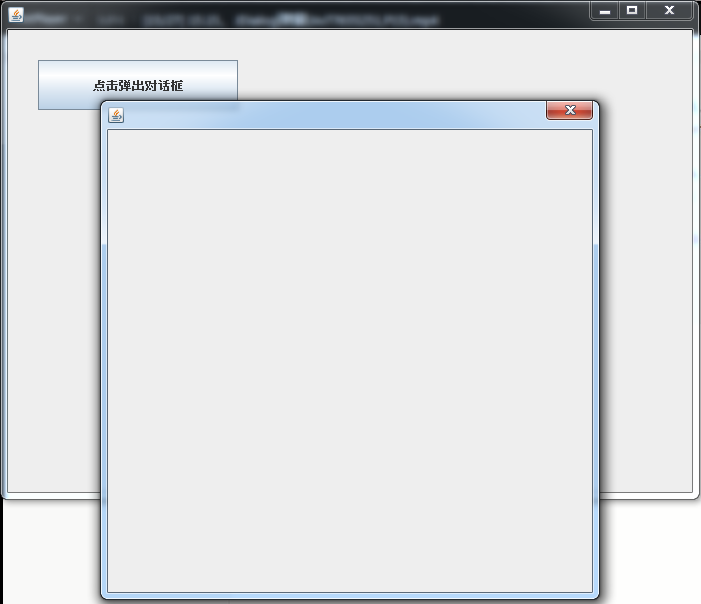


#### 3.3 标签

label

```java
new JLabel("xxx");
```

图标ICON

```java
package cn.akio.lesson04;

import javax.swing.*;
import java.awt.*;

/**
 * @author Akio
 * @ClassName IconDemo
 * @Description 图标
 * @Date 2021/7/13 20:10
 */
//图标，需要实现类，Frame继承
public class IconDemo extends JFrame implements Icon {
    private int width;
    private int height;

    public IconDemo(){}
    public IconDemo(int width, int height){
        this.width = width;
        this.height = height;
    }

    public void init(){
        IconDemo iconDemo = new IconDemo(15,15);
        //图标放在标签，也可以放在按钮上
        JLabel label = new JLabel("ICONTEST",iconDemo,SwingConstants.CENTER);

        Container container = this.getContentPane();
        container.add(label);

        this.setVisible(true);
        this.setDefaultCloseOperation(WindowConstants.EXIT_ON_CLOSE);
    }

    public static void main(String[] args) {
        new IconDemo().init();
    }

    @Override
    public void paintIcon(Component c, Graphics g, int x, int y) {
        g.fillOval(x,y,width,height);
    }

    @Override
    public int getIconWidth() {
        return this.width;
    }

    @Override
    public int getIconHeight() {
        return this.height;
    }
}
```


图片ICON

```java
package cn.akio.lesson04;

import javax.swing.*;
import java.awt.*;
import java.net.URL;

/**
 * @author Akio
 * @ClassName ImageIconDemo
 * @Description 图片标签
 * @Date 2021/7/14 8:51
 */
public class ImageIconDemo extends JFrame {
    public ImageIconDemo(){
        //获取图片的地址
        JLabel label = new JLabel("ImageIcon");
        //通过这个类，获取当前类路径下的东西
        URL url = ImageIconDemo.class.getResource("123.jpg");

        ImageIcon imageIcon = new ImageIcon(url);
        label.setIcon(imageIcon);
        label.setHorizontalAlignment(SwingConstants.CENTER);//水平对齐

        Container container = getContentPane();
        container.add(label);

        setVisible(true);
        setDefaultCloseOperation(WindowConstants.EXIT_ON_CLOSE);
        setBounds(100,100,200,200);
    }

    public static void main(String[] args) {
        new ImageIconDemo();
    }
}
```


注意：有的时候会出现代码无错，但是仍然会出现空指针错误，一般删掉out文件夹再运行就OK

#### 3.4 面板

###### JPanel

```java
package cn.akio.lesson05;

import javax.swing.*;
import java.awt.*;

/**
 * @author Akio
 * @ClassName JPanelDemo
 * @Description 面板
 * @Date 2021/7/14 10:05
 */
public class JPanelDemo extends JFrame {
    public JPanelDemo(){
        Container container = this.getContentPane();

        container.setLayout(new GridLayout(2,2,10,10));//最后的两个参数是间距

        JPanel panel1 = new JPanel(new GridLayout(1,3));
        JPanel panel2 = new JPanel(new GridLayout(1,2));
        JPanel panel3 = new JPanel(new GridLayout(2,1));
        JPanel panel4 = new JPanel(new GridLayout(3,2));

        panel1.add(new JButton("1"));
        panel1.add(new JButton("1"));
        panel1.add(new JButton("1"));

        panel2.add(new JButton("2"));
        panel2.add(new JButton("2"));

        panel3.add(new JButton("3"));
        panel3.add(new JButton("3"));

        panel4.add(new JButton("4"));
        panel4.add(new JButton("4"));
        panel4.add(new JButton("4"));
        panel4.add(new JButton("4"));
        panel4.add(new JButton("4"));
        panel4.add(new JButton("4"));

        container.add(panel1);
        container.add(panel2);
        container.add(panel3);
        container.add(panel4);

        this.setVisible(true);
        this.setSize(500,500);
        this.setDefaultCloseOperation(WindowConstants.EXIT_ON_CLOSE);
    }

    public static void main(String[] args) {
        new JPanelDemo();
    }
}
```

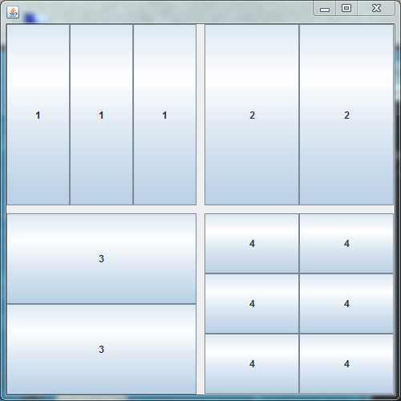


###### JScrollPanel 滚动条

```java
package cn.akio.lesson05;

import javax.swing.*;
import java.awt.*;

/**
 * @author Akio
 * @ClassName JScrollDemo
 * @Description 滚动条
 * @Date 2021/7/15 12:56
 */
public class JScrollDemo extends JFrame{
    public JScrollDemo(){
        Container container = this.getContentPane();

        //文本域
        JTextArea textArea = new JTextArea(20,30);
        textArea.setText("欢迎来到90年代");

        //Scorll面板
        JScrollPane scrollPane = new JScrollPane(textArea);
        container.add(scrollPane);

        this.setVisible(true);
        this.setBounds(100,100,300,350);
        this.setDefaultCloseOperation(WindowConstants.EXIT_ON_CLOSE);
    }
    public static void main(String[] args) {
        new JScrollDemo();
    }
}
```

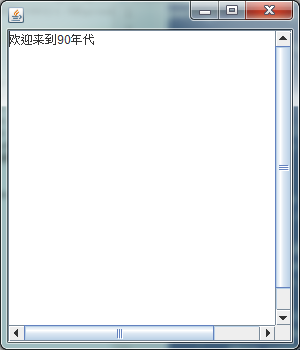


#### 3.5 按钮

- 图片按钮

  ```java
  package cn.akio.lesson05;
  
  import cn.akio.lesson04.ImageIconDemo;
  
  import javax.swing.*;
  import java.awt.*;
  import java.net.URL;
  
  /**
   * @author Akio
   * @ClassName JButtonDemo01
   * @Description TODO
   * @Date 2021/7/15 13:07
   */
  public class JButtonDemo01 extends JFrame {
      public JButtonDemo01(){
          Container container = this.getContentPane();
  
          //将一个图片变成图标
          URL resource = JButtonDemo01.class.getResource("123.jpg");
          Icon icon = new ImageIcon(resource);
  
          //把这个图标放在按钮上
          JButton button = new JButton();
          button.setIcon(icon);
          button.setToolTipText("图片按钮");//鼠标悬停时展示的文本
  
          container.add(button);
  
          this.setVisible(true);
          this.setSize(500,300);
          this.setDefaultCloseOperation(WindowConstants.EXIT_ON_CLOSE);
      }
  
      public static void main(String[] args) {
          new JButtonDemo01();
      }
  }
  //这个只是把图片放到了按钮上
  ```

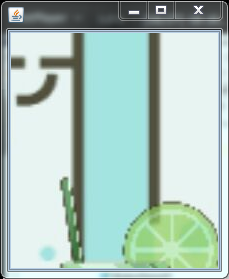

- 单选按钮

  ```java
  package cn.akio.lesson05;
  
  import javax.swing.*;
  import java.awt.*;
  import java.net.URL;
  
  /**
   * @author Akio
   * @ClassName JButtonDemo01
   * @Description TODO
   * @Date 2021/7/15 13:07
   */
  public class JButtonDemo02 extends JFrame {
      public JButtonDemo02(){
          Container container = this.getContentPane();
  
          //将一个图片变成图标
          URL resource = JButtonDemo02.class.getResource("123.jpg");
          Icon icon = new ImageIcon(resource);
  
          //单选框
          JRadioButton radioButton1 = new JRadioButton("JRadioButton01");
          JRadioButton radioButton2 = new JRadioButton("JRadioButton02");
          JRadioButton radioButton3 = new JRadioButton("JRadioButton03");
  
          //由于单选框只能选择一个，所以我们对其进行分组，就是一个组中只能选择一个
          ButtonGroup group = new ButtonGroup();
          group.add(radioButton1);
          group.add(radioButton2);
          group.add(radioButton3);
  
          container.add(radioButton1,BorderLayout.NORTH);
          container.add(radioButton2,BorderLayout.CENTER);
          container.add(radioButton3,BorderLayout.SOUTH);
  
          this.setVisible(true);
          this.setSize(500,300);
          this.setDefaultCloseOperation(WindowConstants.EXIT_ON_CLOSE);
      }
  
      public static void main(String[] args) {
          new JButtonDemo02();
      }
  }
  ```

  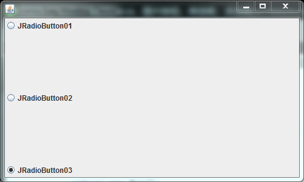

- 复选按钮

  ```java
  package cn.akio.lesson05;
  
  import javax.swing.*;
  import java.awt.*;
  import java.net.URL;
  
  /**
   * @author Akio
   * @ClassName JButtonDemo01
   * @Description TODO
   * @Date 2021/7/15 13:07
   */
  public class JButtonDemo03 extends JFrame {
      public JButtonDemo03(){
          Container container = this.getContentPane();
  
          //将一个图片变成图标
          URL resource = JButtonDemo03.class.getResource("123.jpg");
          Icon icon = new ImageIcon(resource);
  
          //多选框
          JCheckBox checkBox01 = new JCheckBox("checkBox01");
          JCheckBox checkBox02 = new JCheckBox("checkBox02");
  
          container.add(checkBox01,BorderLayout.NORTH);
          container.add(checkBox02,BorderLayout.SOUTH);
  
          this.setVisible(true);
          this.setSize(500,300);
          this.setDefaultCloseOperation(WindowConstants.EXIT_ON_CLOSE);
      }
  
      public static void main(String[] args) {
          new JButtonDemo03();
      }
  }
  ```

  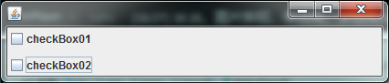


#### 3.6 列表

###### 下拉框

```java
package cn.akio.lesson06;

import javax.swing.*;
import java.awt.*;

/**
 * @author Akio
 * @ClassName TestComboboxDemo01
 * @Description TODO
 * @Date 2021/7/15 18:57
 */
public class TestComboboxDemo01 extends JFrame {
    public TestComboboxDemo01(){
        Container container = this.getContentPane();

        JComboBox status = new JComboBox();

        status.addItem(null);
        status.addItem("正在热映");
        status.addItem("已下架");
        status.addItem("即将上映");

        //如何获取这个值呢？可以使用监听器
        //status.addActionListener();

        container.add(status);//正常情况下我们应该是把下拉框放在panel面板中

        this.setVisible(true);
        this.setSize(500,350);
        this.setDefaultCloseOperation(WindowConstants.EXIT_ON_CLOSE);
    }

    public static void main(String[] args) {
        new TestComboboxDemo01();
    }
}
```

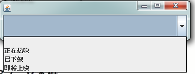


###### 列表框

```java
package cn.akio.lesson06;

import javax.swing.*;
import java.awt.*;
import java.util.Vector;

/**
 * @author Akio
 * @ClassName TestComboboxDemo01
 * @Description TODO
 * @Date 2021/7/15 18:57
 */
public class TestComboboxDemo02 extends JFrame {
    public TestComboboxDemo02(){
        Container container = this.getContentPane();

        //生成列表的内容
        //String[] contents = {"1","2","3"};//静态写死
        Vector contents = new Vector();//动态添加
                                                                                                                                    
        //列表中需要放入内容
        JList jList = new JList(contents);

        contents.add("1");
        contents.add("12");
        contents.add("123");

        container.add(jList);

        this.setVisible(true);
        this.setSize(500,350);
        this.setDefaultCloseOperation(WindowConstants.EXIT_ON_CLOSE);
    }

    public static void main(String[] args) {
        new TestComboboxDemo02();
    }
}
```

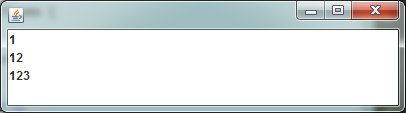

> **应用场景**
>
> - 下拉框：选择地区，或者一些单个选项
> - 列表：展示信息，一般是动态扩容


#### 3.7 文本框

##### 文本框

```java
package cn.akio.lesson06;

import javax.swing.*;
import java.awt.*;

/**
 * @author Akio
 * @ClassName TestTextDemo01
 * @Description TODO
 * @Date 2021/7/15 19:20
 */
public class TestTextDemo01 extends JFrame {
    public TestTextDemo01(){
        Container container = this.getContentPane();

        JTextField textField = new JTextField("hello");
        JTextField textField1 = new JTextField("world",20);//20为默认字符长度

        container.add(textField,BorderLayout.NORTH);
        container.add(textField1,BorderLayout.SOUTH);

        this.setVisible(true);
        this.setSize(500,350);
        this.setDefaultCloseOperation(WindowConstants.EXIT_ON_CLOSE);
    }

    public static void main(String[] args) {
        new TestTextDemo01();
    }
}
```

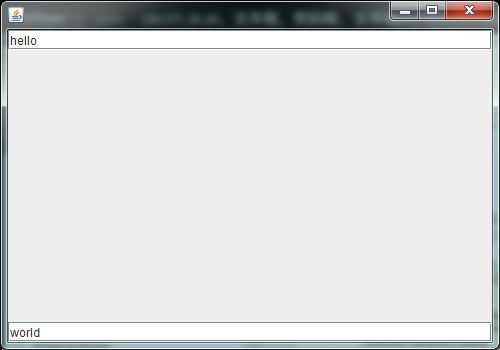

##### 密码框

```java
package cn.akio.lesson06;

import javafx.scene.control.PasswordField;

import javax.swing.*;
import java.awt.*;

/**
 * @author Akio
 * @ClassName TestTextDemo01
 * @Description TODO
 * @Date 2021/7/15 19:20
 */
public class TestTextDemo02 extends JFrame {
    public TestTextDemo02(){
        Container container = this.getContentPane();

        JPasswordField passwordField = new JPasswordField();//****
        passwordField.setEchoChar('*');

        container.add(passwordField);

        this.setVisible(true);
        this.setSize(500,350);
        this.setDefaultCloseOperation(WindowConstants.EXIT_ON_CLOSE);
    }

    public static void main(String[] args) {
        new TestTextDemo02();
    }
}
```

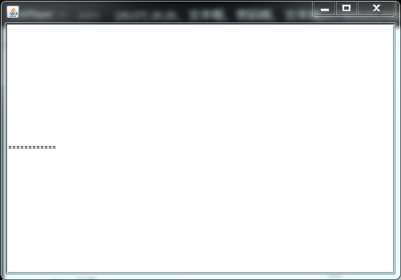


##### 文本域

```java
package cn.akio.lesson05;

import javax.swing.*;
import java.awt.*;

/**
 * @author Akio
 * @ClassName JScrollDemo
 * @Description 滚动条\文本域1
 * @Date 2021/7/15 12:56
 */
public class JScrollDemo extends JFrame{
    public JScrollDemo(){
        Container container = this.getContentPane();

        //文本域
        JTextArea textArea = new JTextArea(20,30);
        textArea.setText("欢迎来到90年代");

        //Scorll面板
        JScrollPane scrollPane = new JScrollPane(textArea);
        container.add(scrollPane);

        this.setVisible(true);
        this.setBounds(100,100,300,350);
        this.setDefaultCloseOperation(WindowConstants.EXIT_ON_CLOSE);
    }
    public static void main(String[] args) {
        new JScrollDemo();
    }
}
```

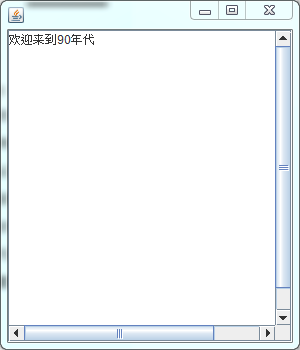


## 二、贪吃蛇项目

### 1、贪吃蛇界面绘制

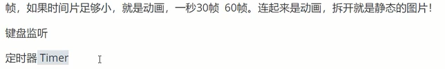


### 2、对于功能的添加

添加功能的步骤：

1、定义数据

2、画上去

3、监听事件
​	键盘
​	事件


### 3、代码结构


```java
package cn.akio.snake;

import javax.swing.*;
import java.net.URL;

/**
 * @author Akio
 * @ClassName Data
 * @Description 数据中心
 * @Date 2021/7/15 19:47
 */
public class Data {
    //相对路径 123.jpg
    //绝对路径  /相当于当前项目
    public static URL headerURL = Data.class.getResource("statics/header.png");
    public static ImageIcon header = new ImageIcon(headerURL);

    public static URL upURL = Data.class.getResource("statics/up.png");
    public static URL downURL = Data.class.getResource("statics/down.png");
    public static URL leftURL = Data.class.getResource("statics/left.png");
    public static URL rightURL = Data.class.getResource("statics/right.png");
    public static ImageIcon up = new ImageIcon(upURL);
    public static ImageIcon down = new ImageIcon(downURL);
    public static ImageIcon left = new ImageIcon(leftURL);
    public static ImageIcon right = new ImageIcon(rightURL);

    public static URL bodyURL = Data.class.getResource("statics/body.png");
    public static ImageIcon body = new ImageIcon(bodyURL);

    public static URL foodURL = Data.class.getResource("statics/food.png");
    public static ImageIcon food = new ImageIcon(foodURL);
}
```

```java
package cn.akio.snake;

import javax.swing.*;

/**
 * @author Akio
 * @ClassName StartGame
 * @Description 游戏主启动类
 * @Date 2021/7/15 19:39
 */
public class StartGame {
    public static void main(String[] args) {
        JFrame frame = new JFrame();

        frame.setBounds(500,230,900,720);
        frame.setResizable(false);//窗口大小不可变
        frame.setDefaultCloseOperation(WindowConstants.EXIT_ON_CLOSE);

        //正常的游戏界面都在面板上
        frame.add(new GamePanel());
        frame.setVisible(true);
    }
}
```

```java
package cn.akio.snake;

import javax.swing.*;
import java.awt.*;
import java.awt.event.ActionEvent;
import java.awt.event.ActionListener;
import java.awt.event.KeyEvent;
import java.awt.event.KeyListener;
import java.util.Random;

/**
 * @author Akio
 * @ClassName GamePanel
 * @Description 游戏的面板
 * @Date 2021/7/15 19:43
 */
public class GamePanel extends JPanel implements KeyListener, ActionListener {

    //定义贪吃蛇的数据结构
    private int length;//蛇的长度
    private int[] snakeX = new int[600];//贪吃蛇的x坐标（600的单位其实是像素） 25*25,贪吃蛇的头和身体的长款都是25
    private int[] snakeY = new int[500];//贪吃蛇的y坐标 25*25
    private String initDir;//初始化方向

    //食物的坐标
    private int foodX;
    private int foodY;
    Random random = new Random();

    int score;//成绩

    //游戏当前状态：start，stop
    private boolean isStart = false;//默认是停止状态
    //游戏是否失败的判定
    private boolean isFail = false;//默认是不失败

    //定时器
    Timer timer = new Timer(100, this);//100ms执行一次

    //构造器
    public GamePanel() {
        init();
        //获得焦点和键盘事件
        this.setFocusable(true);//获取焦点事件
        this.addKeyListener(this);//获得键盘监听事件

        timer.start();//游戏一开始定时器就启动
    }

    //初始化方法
    public void init() {
        length = 3;
        snakeX[0] = 100;//脑袋的坐标
        snakeY[0] = 100;
        snakeX[1] = 75;//第一个身体的坐标
        snakeY[1] = 100;
        snakeX[2] = 50;//第二个身体的坐标
        snakeY[2] = 100;
        initDir = "R";//初始化方向向右

        //食物坐标，这样食物就能随机分布在地图上
        foodX = 25 + 25 * random.nextInt(850 / 25);
        foodY = 75 + 25 * random.nextInt(600 / 25);

        score = 0;
    }

    //绘制面板，我们游戏中的所有东西，都使用这个画笔来画
    @Override
    protected void paintComponent(Graphics g) {
        super.paintComponent(g);//清屏
        //绘制静态的面板
        this.setBackground(Color.WHITE);
        Data.header.paintIcon(this, g, 25, 11);//头部广告/标题栏
        g.fillRect(25, 75, 850, 600);//默认游戏界面

        //画积分
        g.setColor(Color.white);
        g.setFont(new Font("楷体",Font.BOLD,18));
        g.drawString("长度:"+length,750,35);
        g.drawString("分数:"+score,750,50);

        //把贪吃蛇画上去
        //head，需要判断方向
        if (initDir.equals("R")) {
            Data.right.paintIcon(this, g, snakeX[0], snakeY[0]);
        } else if (initDir.equals("L")) {
            Data.left.paintIcon(this, g, snakeX[0], snakeY[0]);
        } else if (initDir.equals("U")) {
            Data.up.paintIcon(this, g, snakeX[0], snakeY[0]);
        } else if (initDir.equals("D")) {
            Data.down.paintIcon(this, g, snakeX[0], snakeY[0]);
        }
        //body
        for (int i = 1; i < length; i++) {
            Data.body.paintIcon(this, g, snakeX[i], snakeY[i]);
        }

        //画食物
        Data.food.paintIcon(this, g, foodX, foodY);

        //游戏状态
        if (isStart == false) {
            g.setColor(Color.WHITE);
            g.setFont(new Font("宋体", Font.BOLD, 20));//设置字体
            g.drawString("press the space to start the game", 280, 300);
        }

        //是否失败状态
        if (isFail) {
            g.setColor(Color.RED);
            g.setFont(new Font("宋体", Font.BOLD, 20));//设置字体
            g.drawString("you Failed, press the space to try again", 260, 300);
        }
    }

    /**
     * 键盘监听事件
     */
    @Override
    public void keyTyped(KeyEvent e) {

    }

    @Override
    public void keyPressed(KeyEvent e) {
        int keyCode = e.getKeyCode();//获取键盘按下了什么
        if (keyCode == KeyEvent.VK_SPACE) {//如何按下的是空格键
            if (isFail) {
                //重新开始
                isFail = false;
                init();
            } else {
                isStart = !isStart;//取反
            }
            repaint();//重新绘制
        }
        //贪吃蛇移动
        if (keyCode == KeyEvent.VK_UP) {
            initDir = "U";
        } else if (keyCode == KeyEvent.VK_DOWN) {
            initDir = "D";
        } else if (keyCode == KeyEvent.VK_LEFT) {
            initDir = "L";
        } else if (keyCode == KeyEvent.VK_RIGHT) {
            initDir = "R";
        }
    }

    @Override
    public void keyReleased(KeyEvent e) {

    }

    /**
     * 事件监听器
     * 事件的监听---需要通过固定事件来判断，1s=10次
     * @param e
     */
    @Override
    public void actionPerformed(ActionEvent e) {
        if (isStart && isFail == false) {//如果游戏是开始状态并且不是失败状态，就让贪吃蛇动起来
            //吃食物
            if (snakeX[0] == foodX && snakeY[0] == foodY) {//当贪吃蛇的头部与食物重合
                length++;//长度+1
                score += 10;//分数+10
                //然后再次随机产生食物
                foodX = 25 + 25 * random.nextInt(850 / 25);
                foodY = 75 + 25 * random.nextInt(600 / 25);
            }

            //移动
            for (int i = length - 1; i > 0; i--) {//后一节移到前一节的位置 snakeX[1] = snakeX[0]
                snakeX[i] = snakeX[i - 1];
                snakeY[i] = snakeY[i - 1];
            }
            //走向
            if (initDir.equals("R")) {
                snakeX[0] = snakeX[0] + 25;
                //边界判断,如果触及边界，就重新从左边出来
                if (snakeX[0] > 850) {
                    snakeX[0] = 25;
                }
            } else if (initDir.equals("L")) {
                snakeX[0] = snakeX[0] - 25;
                //边界判断,如果触及边界，就重新从右边出来
                if (snakeX[0] < 25) {
                    snakeX[0] = 850;
                }
            } else if (initDir.equals("U")) {
                snakeY[0] = snakeY[0] - 25;
                //边界判断,如果触及边界，就重新从下边出来
                if (snakeY[0] < 75) {
                    snakeY[0] = 650;
                }
            } else if (initDir.equals("D")) {
                snakeY[0] = snakeY[0] + 25;
                //边界判断,如果触及边界，就重新从上边出来
                if (snakeY[0] > 650) {
                    snakeY[0] = 75;
                }
            }

            //失败的判断，撞到自己就算失败
            //遍历身体所有的坐标。如果头的坐标与身体坐标重合就是撞到了
            for (int i = 1; i < length; i++) {
                if (snakeX[0]==snakeX[i] && snakeY[0]==snakeY[i]){
                    isFail = true;
                }
            }

            repaint();//重画页面
        }
        timer.start();//定时器开启
    }
}
```

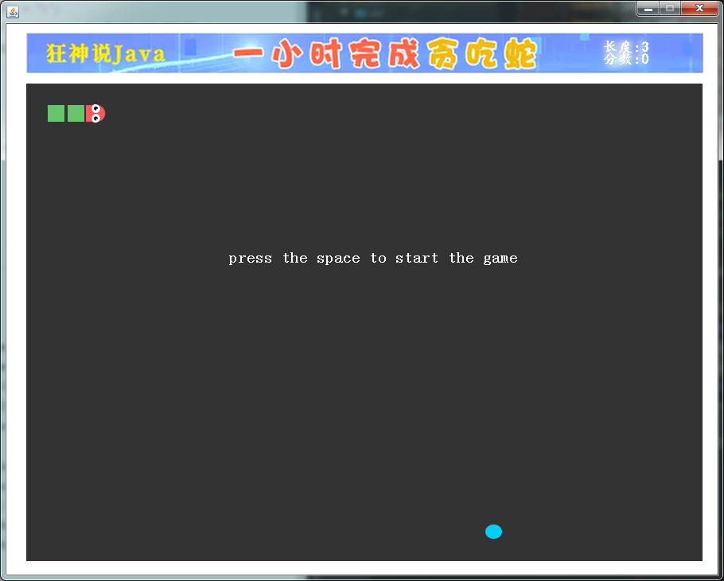

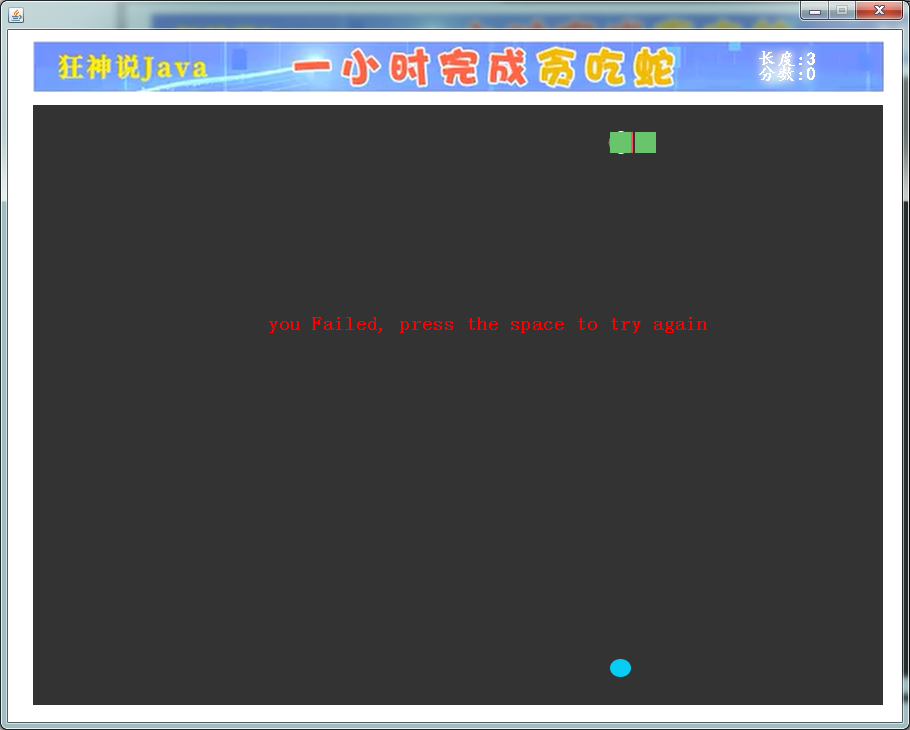


